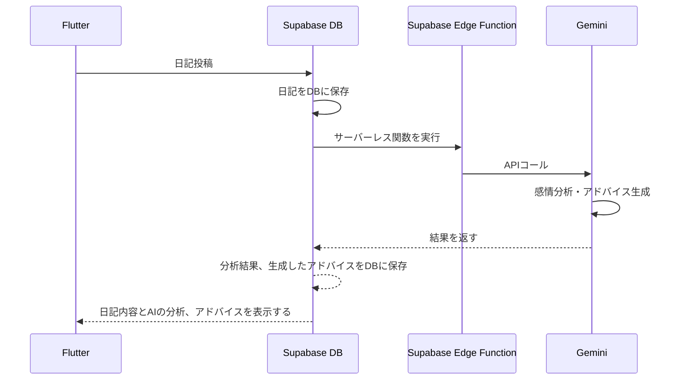

## なぜEdgeFunctions CLIをまとめようと思ったか

### Flutterアプリ開発でのSupabase Edge Functions
[前回の記事](https://zenn.dev/classic/articles/67f2d34368c9a2)では、Flutter × Supabase × Geminiを組み合わせた、モバイルアプリを開発したことを投稿しました。

SupabaseのDBに格納したデータを元に、Gemini APIにリクエストする必要があったのですが、その際利用したのが、**「Supabase Edge Functions」** というサーバレス関数になります。

詳しい実装内容は前回の記事を参考にしていただきたいのですが、基本的な流れとしては、まずユーザがFlutterアプリ上の画面で、日記のタイトルと本文を入力します。

その後、ユーザが投稿ボタンをタップすると、SupabaseのAPIを呼び出し、DBに日記の内容を登録します。

DBに登録した後は、「Supabase Edge Functions」で定義したサーバレス関数が呼ばれ、そのDBの内容を読み取り、Gemini に感情分析や内容を要約してもらう、といった流れになっています。

:::details 全体的なアーキテクチャ


:::

この日記投稿 → Geminiによる分析の橋渡しをする役割が「Supabase Edge Functions」なのですが、サーバ上に公開すると、稼働しているアプリからもコールされることになるため、不具合が起きないように、公開する前にテストする必要があります。

そのテストの方法として推奨されているのが、**ローカル上にSupabaseの環境を立てる事**です。

### Supabaseのローカル環境は大変だった

ローカルにSupabaseの環境を構築するためには、**Supabase CLI**を利用しますが、DBの定義差分をサーバ上に反映したり、Edge Funcionsのローカルでの実施方法など、かなり苦戦しました。

[Supabase CLIのドキュメント](https://supabase.com/docs/guides/local-development)はあるのですが、ユースケースごとにまとまってはいません。

例えばローカルのDB定義を変更した後はどうやって、サーバに反映するのかとか、サーバ上のEdge Functionsをローカルに持ってきて、起動させるにはどうするのか、といったことが分からず、本来集中したい実装とは別の所で苦戦していました。

なので、自分なりにユースケース毎にSupabase CLIをまとめて、後で見返せるようにしたかったのと、他にSupabaseのローカル環境でのやり方を苦戦している方の参考になればと思い、記事を投稿しました。

:::message
以降はWindows環境での話になります。
macOSやLinux環境は、実際にコマンドを実行していないので、記事の内容とは異なるかも知れませんが、それぞれのOSに応じたコマンドも紹介しているので、ご参考にお願いします。
:::

## Dockerの準備
まず、ローカルにSupabaseの環境を構築する前に、Dockerをインストールします。

初めてDockerをインストールする方は、Dockerが簡単にセットアップできる**Docker Desktop**というアプリが公式から提供されているので、こちらを用いてインストールするのがオススメです。

以下のリンク先を元に、DockerDesktopをインストールしてください。

@[card](https://docs.docker.com/desktop/)

## CLIインストール方法
Dockerがインストールできたら、次に**Supabase CLI**をインストールしていきます。

OS毎にインストール方法が異なりますので、各環境に応じてコマンドを実行してください。

::::details Windows
```
scoop bucket add supabase https://github.com/supabase/scoop-bucket.git
scoop install supabase
```
::: message
Windowsは、Scoopというパッケージマネージャーを用いてSupabase CLIをインストールします。
まだScoopをインストールしていない人は、https://scoop.sh/ を参考にインストールしてください。
:::
::::

::::details macOS
```
brew install supabase/tap/supabase
```
::: message
macOSは、Homebrewというパッケージマネージャーを用いてSupabase CLIをインストールします。
まだHomebrewをインストールしていない人は、https://brew.sh/ を参考にインストールしてください。
::::

::::details Linux
LinuxはHomebrewか、Linux packagesを用いてインストールするかのどちらかになります。
ここではHomebrewのインストール方法を紹介します。

```
brew install supabase/tap/supabase
```
::: message
Homebrewをインストールしていない人は、https://brew.sh/ を参考にインストールしてください。
::::

@[card](https://supabase.com/docs/guides/local-development/cli/getting-started?queryGroups=platform&platform=windows&queryGroups=access-method&access-method=studio#installing-the-supabase-cli)

## ローカルのSupabaseを実行する方法
DockerとSupabaseCLIのインストールが完了したら、ローカル環境でSupabaseを実行する準備は完了です！

以下の手順でローカルのSupabaseを動かしましょう。
1. Dockerの起動
2. プロジェクトファイルの作成
3. Supabaseを起動

### 1.Dockerの起動
Supabaseをローカルで動かすためには、Dockerの起動が必要なので、まずはDockerを動かします。

前述したDockerDesktopをインストールした方は、DockerDesktopアプリを起動するだけで、準備完了です。

### 2.プロジェクトファイルの作成
次にSupabaseを構築したいディレクトリで、プロジェクトファイルを作成します。

以下のコマンドで、プロジェクトファイルを作成することができます。
```
supabase init
```

### 3.Supabaseの起動
最後にSupabaseを起動します。プロジェクトファイルを作成したディレクトリで、以下のコマンドを実行します。

```
supabase start
```

最初にこのコマンドを実行したときは、Dockerイメージをローカルにダウンロードする必要があるため、時間が掛かる可能性があります。

コマンドを実行後、次のような出力になれば起動完了です！
(※一部実行結果を隠しています)


## 各ユースケースの紹介
ここから各ユースケースの紹介になります。(やっと本題ですね！)

私のアプリ開発で実際に良くやったケースを紹介して、Supabase CLIの概要を把握してもらえればと思います。

ここの記事に紹介しているコマンドは、執筆時点での最新のドキュメントを確認していますが、ご自身でも必ず公式ドキュメントを確認するように、お願いいたします。

@[card](https://supabase.com/docs/reference/cli/start)

### Edge Functionsをローカルで動かして、テストとデプロイするケース
Edge Functionsをローカルで起動して、テストとデプロイするフローを紹介します。

Edge Functionsはサーバで編集することもできますが、サーバに公開する前にローカルでテストしたい場合は、こちらの方法が役に立つと思います。

#### Edge Functionsを作成する方法
まず、ローカルのプロジェクトとサーバ上のSupabaseを紐づける必要があります。

次のコマンドで、Supabaseのアカウント情報を紐づけましょう！
`supabase login`

そして、紐づけたいSupabaseのプロジェクトを指定します。
`supabase link --project-ref [プロジェクト番号] `

プロジェクトの番号が分からない場合は、次のコマンドで出力された紐づけたいプロジェクトの*REFERENCE ID*を上記コマンドで指定します。
`supabase projects list`


プロジェクトの紐づけまで完了したら、次のコマンドで新しい関数を作成します。
`supabase functions new <関数名>`

新しい関数を作成すると、`supabase/functions`フォルダの中に関数名のフォルダが作成され、その中に`index.ts`が配置されます。
`index.ts`が関数の実装内容になります。

#### ローカルで動かす方法
作成した関数をローカルで実行するには、次のコマンドを実行します
`supabase functions serve`


実行した後、http://127.0.0.1:54321/functions/v1/{関数名} のような出力が得られたら、関数が認識されローカルでリクエストを受け付ける状態になります。

この状態でCURLコマンドなどで、APIリクエストを送ることで、関数を実行することができます。

次のコマンドは、CURLコマンドの例です。
```
curl --request POST 'https://127.0.0.1:54321/functions/v1/{関数名}' \
  --header 'Authorization: Bearer ANON_KEY' \
  --header 'Content-Type: application/json' \
  --data '{ "name":"Functions" }'
```

ヘッダーにANON_KEYを含める必要がありますが、これは`supabase status`で確認することができます。

#### --no-verify-JWTの注意点
関数を実行する際、デフォルトでJWT検証がONになっています。ただし、このJWT検証は旧方式となるため、**公式はJWT検証をOFFにし、関数内で独自に認証/認可ロジックを組む**ことを推奨しています。

このJWT検証をOFFにするためには、①`supabase functions serve`にオプションを付ける方法と②config.tomlファイルに設定をする方法があります。

前者の関数の実行時にフラグを付ける方法は、失念してしまうと、デフォルトのJWT検証がONになってしまうため、後者のconfig.tomlで設定をする方法をオススメします。

##### フラグを付けてデプロイするか、config.tomlに設定するか

##### アクセストークンが必要になる
#### Edge Functionsをデプロイする方法

### サーバのDB定義をローカルDBに反映して、DB定義変更＆デプロイするケース
#### ローカルDBに定義を反映する方法
#### サーバー上のデータを取得し、ローカルに反映する方法
#### DB定義やRLSを変更し、マイグレーションファイルを作成する方法
#### サーバへ反映する方法
### アプリ実行時に、ローカルのSupabaseにつなげる方法